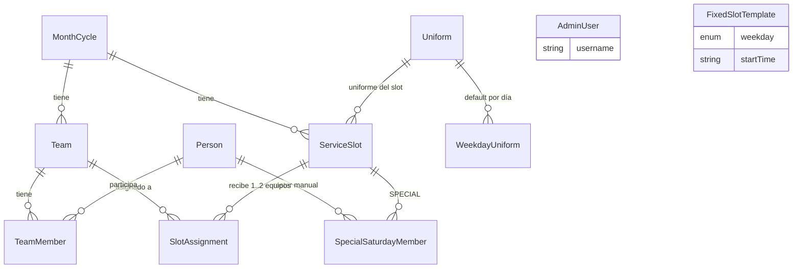

# Fase 1 — Diseño técnico cerrado (esquema de datos + estructura de proyecto)

**Estado:** propuesta cerrada para implementar. Documento de referencia para `backend-developer` y `frontend-developer`.
**Fecha:** 2026-08-07
**Alcance:** Fase 1 del plan (`base del proyecto`): scaffolding de `/server` y `/client`, `prisma/schema.prisma` completo, migración inicial y seed. **No** incluye lógica de negocio (sorteo, balance, import) — eso es Fase 2-4.

Este documento resuelve todas las ambigüedades del plan para que quien implemente **no tenga que decidir nada de diseño**. Las decisiones que tomé por mi cuenta están numeradas (`D1`…`D16`) y las que **requieren confirmación del usuario** están marcadas con **[CONFIRMAR]**.

Referencias leídas: `CLAUDE.md` (raíz del repo) y `C:\Users\Usuario\.claude\plans\resilient-humming-lampson.md`.
Estado real del repo al escribir esto: **vacío** (solo `CLAUDE.md` y `.claude/agents/`). No hay código con el que contrastar todavía.

---

## 0. Resumen de las invariantes que el esquema debe proteger

| # | Invariante de negocio | Dónde se protege |
|---|---|---|
| I1 | Exactamente 1 líder por equipo | Índice único parcial `team_member_one_leader_per_team` (SQL crudo) — garantiza ≤1; el servicio garantiza ≥1 |
| I2 | Una persona pertenece a un solo equipo en el mes | `TeamMember @@unique([monthCycleId, personId])` + FK compuesta a `Team(id, monthCycleId)` |
| I3 | Un colaborador solo es líder con override explícito | Columna `TeamMember.manualOverride` + validación en servicio (no se puede expresar en DDL) |
| I4 | El último domingo tiene un solo slot 8:00 con `teamsNeeded = 2` | Lógica en `scheduleGeneration.service.js` + `CHECK teams_needed BETWEEN 1 AND 2` |
| I5 | El slot `SPECIAL` nunca suma al balance | `CHECK (slot_type <> 'SPECIAL' OR counts_toward_balance = false)` |
| I6 | El evento especial no excluye a nadie de su equipo regular | `SpecialSaturdayMember` es una tabla aparte, sin relación con `TeamMember` |
| I7 | Un slot no puede tener más equipos de los que necesita | `@@unique([serviceSlotId, slotIndex])` + `CHECK slot_index BETWEEN 0 AND 1` (tope duro de 2) + validación `slotIndex < teamsNeeded` en servicio |
| I8 | Un slot no puede repetir el mismo equipo | `@@unique([serviceSlotId, teamId])` |
| I9 | Un slot solo puede recibir equipos de su propio mes | FKs compuestas de `SlotAssignment` a `ServiceSlot(id, monthCycleId)` **y** a `Team(id, monthCycleId)`, compartiendo la columna `month_cycle_id` |
| I10 | `recomputeBalance` no mueve asignaciones fijadas | Columna `SlotAssignment.locked` + contrato del servicio (ver §5) |

I9 es la protección más fuerte que agregué respecto del plan: hace **imposible a nivel de base de datos** asignar un equipo de marzo a un slot de abril.

---

## 1. `server/prisma/schema.prisma` — contenido final

> Verificado: este esquema pasa `prisma validate` y genera DDL correcto tanto en **Prisma 6.19.3** como en **Prisma 7.9.1** (el cuerpo es idéntico; solo cambia el encabezado `generator`/`datasource`, ver §6 y Apéndice A).

```prisma
// ---------------------------------------------------------------------------
// App de organización de equipos y turnos de servicio
// Reglas de negocio: ver CLAUDE.md en la raíz del repo.
// Convención: modelos y campos en camelCase/PascalCase (Prisma) mapeados a
// snake_case en PostgreSQL vía @map/@@map.
// ---------------------------------------------------------------------------

generator client {
  provider = "prisma-client-js"
}

datasource db {
  provider = "postgresql"
  url      = env("DATABASE_URL")
}

// ------------------------------- ENUMS -------------------------------------

/// Categoría de la persona en el padrón. Los valores están en español a
/// propósito: son los que llegan literalmente en el CSV/XLSX de carga masiva.
enum PersonCategory {
  INSTRUCTOR
  MINISTRO

  @@map("person_category")
}

/// Rol de una persona DENTRO de un equipo mensual.
enum TeamRole {
  LEADER
  SUPPORT
  COLLABORATOR

  @@map("team_role")
}

/// FIXED         = turno fijo semanal (miércoles / domingo)
/// EXTRAORDINARY = evento extraordinario creado por el admin (SÍ cuenta al balance)
/// SPECIAL       = evento del último sábado (NO cuenta al balance, roster manual)
enum SlotType {
  FIXED
  EXTRAORDINARY
  SPECIAL

  @@map("slot_type")
}

/// DRAFT     = el admin todavía puede re-sortear equipos
/// FINALIZED = el mes está publicado
enum MonthStatus {
  DRAFT
  FINALIZED

  @@map("month_status")
}

enum Weekday {
  MONDAY
  TUESDAY
  WEDNESDAY
  THURSDAY
  FRIDAY
  SATURDAY
  SUNDAY

  @@map("weekday")
}

// ------------------------------- ACCESO ------------------------------------

/// Único administrador por ahora. Es una tabla (no una constante) para no
/// bloquear "múltiples administradores" a futuro. Se crea vía seed, no hay UI
/// de registro.
model AdminUser {
  id           String    @id @default(cuid())
  username     String    @unique
  passwordHash String    @map("password_hash")
  displayName  String?   @map("display_name")
  active       Boolean   @default(true)
  lastLoginAt  DateTime? @map("last_login_at")
  createdAt    DateTime  @default(now()) @map("created_at")
  updatedAt    DateTime  @updatedAt @map("updated_at")

  @@map("admin_user")
}

// ------------------------------- PADRÓN ------------------------------------

model Person {
  id         String         @id @default(cuid())
  fullName   String         @map("full_name")
  /// Documento opcional. Es la clave natural preferida para el upsert del
  /// import masivo. Postgres permite múltiples NULL en un índice único, así
  /// que "opcional + único" convive sin problema.
  documentId String?        @unique @map("document_id")
  category   PersonCategory
  /// Baja lógica. NUNCA se borra una persona que ya participó en un mes
  /// (las FK desde TeamMember son onDelete: Restrict).
  active     Boolean        @default(true)
  notes      String?
  createdAt  DateTime       @default(now()) @map("created_at")
  updatedAt  DateTime       @updatedAt @map("updated_at")

  teamMemberships   TeamMember[]
  specialEventRoles SpecialSaturdayMember[]

  /// Consulta caliente: pool de sorteo = personas activas por categoría.
  @@index([active, category])
  @@index([fullName])
  @@map("person")
}

// --------------------------- CICLO MENSUAL ---------------------------------

model MonthCycle {
  id          String      @id @default(cuid())
  year        Int
  month       Int
  /// Cuántos equipos definió el admin para este mes.
  teamCount   Int         @map("team_count")
  status      MonthStatus @default(DRAFT)
  finalizedAt DateTime?   @map("finalized_at")
  createdAt   DateTime    @default(now()) @map("created_at")
  updatedAt   DateTime    @updatedAt @map("updated_at")

  teams        Team[]
  serviceSlots ServiceSlot[]

  @@unique([year, month])
  @@index([status])
  @@map("month_cycle")
}

model Team {
  id           String   @id @default(cuid())
  monthCycleId String   @map("month_cycle_id")
  /// Etiqueta visible: "Equipo 1", "Equipo 2"...
  label        String
  /// Orden estable de presentación e identificador interno 1..teamCount.
  orderIndex   Int      @map("order_index")
  createdAt    DateTime @default(now()) @map("created_at")
  updatedAt    DateTime @updatedAt @map("updated_at")

  monthCycle      MonthCycle       @relation(fields: [monthCycleId], references: [id], onDelete: Cascade)
  members         TeamMember[]
  slotAssignments SlotAssignment[]

  @@unique([monthCycleId, label])
  @@unique([monthCycleId, orderIndex])
  /// Necesario para que TeamMember y SlotAssignment puedan apuntar a
  /// (id, monthCycleId) con FK compuesta. No borrar.
  @@unique([id, monthCycleId])
  @@index([monthCycleId])
  @@map("team")
}

model TeamMember {
  id             String   @id @default(cuid())
  teamId         String   @map("team_id")
  /// Denormalizado desde Team a propósito: habilita el único
  /// @@unique([monthCycleId, personId]) — "una persona, un solo equipo al mes".
  /// La FK compuesta garantiza que este valor SIEMPRE coincide con
  /// team.monthCycleId; no es posible desincronizarlo.
  monthCycleId   String   @map("month_cycle_id")
  personId       String   @map("person_id")
  role           TeamRole
  /// true cuando el admin forzó el rol a mano (p. ej. promover un MINISTRO
  /// a LEADER). El sorteo automático NUNCA escribe true aquí.
  manualOverride Boolean  @default(false) @map("manual_override")
  createdAt      DateTime @default(now()) @map("created_at")
  updatedAt      DateTime @updatedAt @map("updated_at")

  team   Team   @relation(fields: [teamId, monthCycleId], references: [id, monthCycleId], onDelete: Cascade)
  person Person @relation(fields: [personId], references: [id], onDelete: Restrict)

  @@unique([teamId, personId])
  @@unique([monthCycleId, personId])
  @@index([teamId, role])
  @@index([personId])
  @@map("team_member")
}

// ------------------------------ UNIFORMES ----------------------------------

model Uniform {
  id          String   @id @default(cuid())
  name        String   @unique
  /// Color para el chip/etiqueta en la página pública (ej. "#1E40AF").
  colorHex    String?  @map("color_hex")
  description String?
  active      Boolean  @default(true)
  createdAt   DateTime @default(now()) @map("created_at")
  updatedAt   DateTime @updatedAt @map("updated_at")

  serviceSlots    ServiceSlot[]
  weekdayUniforms WeekdayUniform[]

  @@map("uniform")
}

/// Configuración editable: qué uniforme corresponde a cada día de la semana.
/// Se usa para poblar ServiceSlot.uniformId al generar los slots FIXED del mes.
/// Cambiar esta tabla NO reescribe los slots ya generados (ver D9).
model WeekdayUniform {
  id        String   @id @default(cuid())
  weekday   Weekday  @unique
  uniformId String   @map("uniform_id")
  updatedAt DateTime @updatedAt @map("updated_at")

  uniform Uniform @relation(fields: [uniformId], references: [id], onDelete: Restrict)

  @@map("weekday_uniform")
}

// ---------------------------- HORARIO / SLOTS ------------------------------

/// Definición de los turnos fijos semanales (miércoles 17:00/19:00,
/// domingo 08:00/10:30). Es data seeded, no constantes en el código, para que
/// cambiar un horario no exija un deploy. La EXCEPCIÓN del último domingo
/// (omitir 10:30 y poner teamsNeeded = 2 en el de 08:00) vive en
/// scheduleGeneration.service.js, NO aquí (ver D10).
model FixedSlotTemplate {
  id          String   @id @default(cuid())
  weekday     Weekday
  startTime   String   @map("start_time") @db.VarChar(5)
  teamsNeeded Int      @default(1) @map("teams_needed")
  active      Boolean  @default(true)
  createdAt   DateTime @default(now()) @map("created_at")
  updatedAt   DateTime @updatedAt @map("updated_at")

  @@unique([weekday, startTime])
  @@map("fixed_slot_template")
}

model ServiceSlot {
  id                  String   @id @default(cuid())
  monthCycleId        String   @map("month_cycle_id")
  /// Fecha civil (sin hora, sin zona horaria). Ver D7.
  date                DateTime @db.Date
  /// Hora local en formato "HH:mm" 24h, cero-padded ("08:00", "18:50").
  /// Ordena correctamente en forma lexicográfica. Ver D7.
  startTime           String   @map("start_time") @db.VarChar(5)
  slotType            SlotType @map("slot_type")
  /// Nombre visible del evento (solo EXTRAORDINARY/SPECIAL). Los FIXED lo
  /// dejan en null y la UI los rotula por día/hora.
  title               String?
  /// 1 por defecto; 2 en el último domingo y opcionalmente en extraordinarios.
  teamsNeeded         Int      @default(1) @map("teams_needed")
  /// false SOLO para SPECIAL (garantizado por CHECK en la migración).
  countsTowardBalance Boolean  @default(true) @map("counts_toward_balance")
  uniformId           String?  @map("uniform_id")
  notes               String?
  createdAt           DateTime @default(now()) @map("created_at")
  updatedAt           DateTime @updatedAt @map("updated_at")

  monthCycle     MonthCycle              @relation(fields: [monthCycleId], references: [id], onDelete: Cascade)
  uniform        Uniform?                @relation(fields: [uniformId], references: [id], onDelete: SetNull)
  assignments    SlotAssignment[]
  specialMembers SpecialSaturdayMember[]

  /// Hace idempotente la generación de slots fijos del mes: re-ejecutarla no
  /// duplica. Incluye slotType para no bloquear un extraordinario que caiga a
  /// la misma hora que un turno fijo.
  @@unique([monthCycleId, date, startTime, slotType])
  /// Necesario para la FK compuesta desde SlotAssignment. No borrar.
  @@unique([id, monthCycleId])
  /// Consulta caliente: slots del mes en orden cronológico (recomputeBalance,
  /// página pública).
  @@index([monthCycleId, date, startTime])
  @@index([monthCycleId, slotType])
  @@index([monthCycleId, countsTowardBalance])
  @@map("service_slot")
}

/// Un equipo asignado a un slot. Tabla puente con id propio (no PK compuesta)
/// porque a futuro los reportes de asistencia colgarán de aquí (ver §7).
model SlotAssignment {
  id            String   @id @default(cuid())
  serviceSlotId String   @map("service_slot_id")
  teamId        String   @map("team_id")
  /// Compartido por AMBAS FK compuestas: hace imposible asignar un equipo de
  /// un mes a un slot de otro mes.
  monthCycleId  String   @map("month_cycle_id")
  /// 0 o 1. Da orden estable de presentación cuando un slot lleva 2 equipos
  /// (último domingo) y evita un tercer equipo por unicidad.
  slotIndex     Int      @default(0) @map("slot_index")
  /// true = asignación fijada a mano; recomputeBalance NO la mueve.
  locked        Boolean  @default(false)
  createdAt     DateTime @default(now()) @map("created_at")
  updatedAt     DateTime @updatedAt @map("updated_at")

  serviceSlot ServiceSlot @relation(fields: [serviceSlotId, monthCycleId], references: [id, monthCycleId], onDelete: Cascade)
  team        Team        @relation(fields: [teamId, monthCycleId], references: [id, monthCycleId], onDelete: Cascade)

  @@unique([serviceSlotId, teamId])
  @@unique([serviceSlotId, slotIndex])
  /// Consulta caliente: conteo de participaciones por equipo en el mes.
  @@index([teamId])
  @@index([monthCycleId, teamId])
  @@map("slot_assignment")
}

/// Roster manual del evento del último sábado. Cuelga del ServiceSlot SPECIAL
/// (no del MonthCycle) — ver D11. Es deliberadamente independiente de
/// TeamMember: estar aquí NO excluye a la persona de su equipo regular.
model SpecialSaturdayMember {
  id            String   @id @default(cuid())
  serviceSlotId String   @map("service_slot_id")
  personId      String   @map("person_id")
  createdAt     DateTime @default(now()) @map("created_at")

  serviceSlot ServiceSlot @relation(fields: [serviceSlotId], references: [id], onDelete: Cascade)
  person      Person      @relation(fields: [personId], references: [id], onDelete: Restrict)

  @@unique([serviceSlotId, personId])
  @@index([personId])
  @@map("special_saturday_member")
}
```

### Diagrama de relaciones



---

## 2. SQL crudo que hay que agregar a la migración inicial

Prisma no expresa `CHECK` ni índices únicos **parciales** en el schema. Después de correr `npx prisma migrate dev --name init --create-only`, **añadir este bloque al final** del archivo `server/prisma/migrations/<ts>_init/migration.sql` y recién ahí aplicar la migración. No es opcional: aquí viven varias invariantes duras del dominio.

```sql
-- I1: como máximo un LEADER por equipo (la existencia de al menos uno la
-- garantiza teamGeneration.service.js).
CREATE UNIQUE INDEX "team_member_one_leader_per_team"
  ON "team_member" ("team_id")
  WHERE "role" = 'LEADER';

-- MonthCycle: mes/año/cantidad de equipos con sentido.
ALTER TABLE "month_cycle"
  ADD CONSTRAINT "month_cycle_month_range"  CHECK ("month" BETWEEN 1 AND 12),
  ADD CONSTRAINT "month_cycle_year_range"   CHECK ("year"  BETWEEN 2000 AND 2200),
  ADD CONSTRAINT "month_cycle_team_count_positive" CHECK ("team_count" >= 1);

-- I4 + I5 + formato de hora.
ALTER TABLE "service_slot"
  ADD CONSTRAINT "service_slot_teams_needed_range" CHECK ("teams_needed" BETWEEN 1 AND 2),
  ADD CONSTRAINT "service_slot_start_time_format"
      CHECK ("start_time" ~ '^([01][0-9]|2[0-3]):[0-5][0-9]$'),
  ADD CONSTRAINT "service_slot_special_never_counts"
      CHECK ("slot_type" <> 'SPECIAL' OR "counts_toward_balance" = false);

-- I7: tope duro de 2 equipos por slot.
ALTER TABLE "slot_assignment"
  ADD CONSTRAINT "slot_assignment_slot_index_range" CHECK ("slot_index" BETWEEN 0 AND 1);

ALTER TABLE "fixed_slot_template"
  ADD CONSTRAINT "fixed_slot_template_start_time_format"
      CHECK ("start_time" ~ '^([01][0-9]|2[0-3]):[0-5][0-9]$'),
  ADD CONSTRAINT "fixed_slot_template_teams_needed_range"
      CHECK ("teams_needed" BETWEEN 1 AND 2);
```

> Nota para quien implemente: `prisma migrate dev` puede detectar drift si alguien luego corre `migrate reset` esperando que el schema declare estos objetos. Es el costo conocido de los CHECK en Prisma y es aceptable — mientras el SQL viva dentro del archivo de migración versionado, `reset` los vuelve a aplicar.

---

## 3. Seed inicial (`server/prisma/seed.js`)

Contenido mínimo, idempotente (`upsert`), sin datos de prueba:

1. **AdminUser** único, tomando `ADMIN_USERNAME` y `ADMIN_PASSWORD` de `.env`; hash con `bcrypt` (cost 12). Si `ADMIN_PASSWORD` no está definida, **abortar con error** — nunca una contraseña por defecto hardcodeada.
2. **Uniform**: `"Uniforme A"` y `"Uniforme B"` (nombres editables luego desde el admin).
3. **WeekdayUniform**: `WEDNESDAY → Uniforme A`, `SUNDAY → Uniforme B`.
4. **FixedSlotTemplate**: `(WEDNESDAY, "17:00")`, `(WEDNESDAY, "19:00")`, `(SUNDAY, "08:00")`, `(SUNDAY, "10:30")`, todos con `teamsNeeded = 1`.

El evento del último sábado (18:50) **no** se siembra aquí: se crea como `ServiceSlot` tipo `SPECIAL` al generar el mes (Fase 4).

---

## 4. Estructura de carpetas

### `/server`

```
server/
  .env                      (NO se commitea)
  .env.example              DATABASE_URL, JWT_SECRET, ADMIN_USERNAME, ADMIN_PASSWORD,
                            PORT, CLIENT_ORIGIN, APP_TIMEZONE
  package.json              "type": "module"
  prisma/
    schema.prisma
    seed.js
    migrations/
  src/
    index.js                bootstrap: carga env, monta app, listen
    app.js                  crea la app Express (helmet, cors, json, rutas,
                            errorHandler). Separado de index.js para poder
                            testear con supertest sin abrir un puerto.
    config/
      env.js                lee y VALIDA process.env con zod; exporta objeto
                            tipado. Falla al arrancar si falta algo.
    lib/
      prisma.js             instancia única de PrismaClient (singleton)
      cache.js              caché en memoria del endpoint público + invalidación
    middleware/
      auth.js               verifica JWT, adjunta req.admin. Protege /api/admin/*
      validate.js           valida body/query/params contra un esquema zod
      rateLimit.js          limitadores: loginLimiter, publicLimiter
      errorHandler.js       último middleware: mapea errores a JSON sin filtrar
                            stack traces ni detalles de Prisma
    routes/
      index.js              monta todos los routers bajo /api
      auth.routes.js        POST /api/auth/login
      people.routes.js      CRUD + POST /api/people/import
      months.routes.js      POST /api/months, GET /api/months, GET /api/months/:id
      teams.routes.js       POST /api/months/:id/generate-teams, GET/PATCH equipos
      events.routes.js      POST/DELETE /api/months/:id/events (extraordinarios)
      assignments.routes.js PATCH /api/assignments/:id (lock/unlock, cambiar equipo)
      specialSaturday.routes.js  roster manual del último sábado
      uniforms.routes.js    CRUD de Uniform + configuración de WeekdayUniform
      schedule.routes.js    GET /api/schedule/:year/:month  (PÚBLICO, sin auth)
    services/
      teamGeneration.service.js
      scheduleGeneration.service.js
      balance.service.js
      importPeople.service.js
      auth.service.js
    utils/
      dates.js              utilidades de fecha civil: lastSundayOf(year, month),
                            lastSaturdayOf(...), weekdaysIn(...), formatTime.
                            TODO cálculo de calendario pasa por aquí.
      errors.js             clases AppError/HttpError con statusCode
      shuffle.js            barajado determinista opcional (seed) para tests
```

**Regla de capas (no negociable):** `routes/` solo parsea request, aplica auth/validación y serializa la respuesta. Toda la lógica de dominio vive en `services/`. Solo `services/` y `prisma/seed.js` importan `lib/prisma.js`.

Diferencias respecto del plan, todas aditivas: `app.js`, `config/env.js`, `lib/`, `utils/`, `middleware/{validate,rateLimit,errorHandler}.js`, y dos routers nuevos — `uniforms.routes.js` (el plan lo omitió pese a que `CLAUDE.md` exige uniformes configurables) y `assignments.routes.js` (necesario para poder marcar `locked`, que el plan menciona pero no expone en ningún endpoint).

### `/client`

```
client/
  .env.example              VITE_API_URL
  index.html
  vite.config.js            + proxy /api -> http://localhost:PORT en dev
  src/
    main.jsx
    App.jsx                 router + providers (Theme, Auth)
    api/
      client.js             wrapper de fetch/axios + interceptor JWT + manejo
                            uniforme de errores
      people.js             funciones por recurso (getPeople, importPeople, ...)
      months.js
      schedule.js
      uniforms.js
    context/
      AuthContext.jsx       token en memoria + localStorage, login/logout
      ThemeContext.jsx      claro/oscuro, respeta prefers-color-scheme
    hooks/
      useApi.js             estado loading/error/data para llamadas
      useToast.js
    pages/
      PublicSchedule.jsx        "/"
      AdminLogin.jsx            "/admin/login"
      AdminDashboard.jsx        "/admin" (layout + <Outlet/>)
      PeopleManager.jsx         "/admin/personas"
      TeamGenerator.jsx         "/admin/equipos"
      EventsManager.jsx         "/admin/eventos"
      SpecialSaturdayManager.jsx "/admin/sabado-especial"
      UniformsManager.jsx       "/admin/uniformes"
      NotFound.jsx
    components/
      ProtectedRoute.jsx
      Layout/{AppHeader,ThemeToggle,NavTabs}.jsx
      ui/{Button,Table,Modal,Field,FileUpload,Badge,EmptyState,Spinner,
          ErrorMessage,ConfirmDialog}.jsx
      domain/{TeamCard,MemberList,CalendarGrid,SlotCard,UniformBadge,
              BalanceSummary}.jsx
    styles/
      tokens.css            variables CSS: color, espaciado, tipografía,
                            radios. Tema claro y oscuro por [data-theme]
      global.css
```

**Rutas en español** (`/admin/personas`, `/admin/equipos`): la app la usa gente no técnica y `frontend-developer` tiene mandato de usar el lenguaje del dominio. **[CONFIRMAR]** si se prefieren rutas en inglés.

---

## 5. Contrato de `recomputeBalance` que el esquema asume

No es Fase 1, pero el esquema está diseñado alrededor de este contrato y conviene fijarlo ahora para que Fase 4 no tenga que rediseñar tablas:

1. Corre **dentro de una transacción** (`prisma.$transaction`).
2. Borra las `SlotAssignment` del mes con `locked = false`. **Nunca** toca las `locked = true`.
3. Recorre los `ServiceSlot` con `countsTowardBalance = true` en orden `(date ASC, startTime ASC)`.
4. Para cada slot, calcula cuántos equipos faltan: `teamsNeeded − (asignaciones locked existentes)`.
5. Elige los equipos con menor conteo acumulado en el mes (contando **también** las `locked`, que ya ocupan cupo), desempate aleatorio, sin repetir equipo dentro del mismo slot (I8).
6. Asigna a los nuevos el menor `slotIndex` libre del slot (0, luego 1).

Consecuencia de diseño: el conteo de participaciones **es** `COUNT(slot_assignment)` filtrado por `serviceSlot.countsTowardBalance = true`. No hay contador denormalizado que mantener sincronizado — a esta escala (decenas de filas por mes) es la opción correcta y elimina toda una clase de bugs de desincronización.

---

## 6. Decisiones tomadas (revisables por el usuario)

**D1 — Prisma 6.19.x, no Prisma 7.** `npm i prisma@latest` hoy instala 7.x, que **rompe** la sintaxis clásica: prohíbe `url = env("DATABASE_URL")` en el datasource y exige `prisma.config.ts` + un driver adapter (`@prisma/adapter-pg`). Verifiqué que el cuerpo del esquema de arriba es idéntico y válido en ambas versiones; solo cambia el encabezado. Para Fase 1 recomiendo **fijar `prisma@^6.19` y `@prisma/client@^6.19`** (menos piezas móviles, `prisma db seed` clásico, toda la documentación existente aplica). El Apéndice A tiene el delta exacto si el usuario prefiere 7.x.

**D2 — Valores de enum en dos idiomas, a propósito.** `PersonCategory` en español (`INSTRUCTOR`/`MINISTRO`) porque son los literales que llegan en el CSV y los que `CLAUDE.md` confirmó con el usuario; el resto de enums en inglés como el resto del código. Es una inconsistencia deliberada: alinearlos obligaría a traducir en el import o a cambiar vocabulario ya acordado.

**D3 — Enums nativos de Postgres, no `String`.** Integridad a nivel de motor y tipado en el cliente Prisma. Costo: agregar un valor exige migración (`ALTER TYPE ... ADD VALUE`, barato en PG ≥ 12). Los cinco enums son cerrados y estables, así que el costo casi nunca se paga.

**D4 — Se elimina `Team.leaderPersonId` (deviación del plan).** El plan lo tenía *además* de `TeamMember.role = LEADER`, o sea dos fuentes de verdad que hay que sincronizar a mano en cada edición manual. Fuente única: `TeamMember`, con el índice único parcial que impide un segundo líder. El líder del mes anterior (para la regla de no repetición) sale de `teamMember.findMany({ where: { role: 'LEADER', monthCycleId: prevId } })`, cubierto por `@@index([teamId, role])` y por la columna denormalizada `monthCycleId`.

**D5 — `TeamMember.monthCycleId` denormalizado + FK compuesta.** Habilita `@@unique([monthCycleId, personId])` (I2) sin ningún riesgo de desincronización, porque la FK apunta a `Team(id, monthCycleId)`. Verificado: Prisma genera la FK compuesta correctamente.

**D6 — `SlotAssignment` con FK compuestas a slot **y** a team (I9).** Ambas comparten la columna `month_cycle_id`. Verifiqué explícitamente que Prisma 6 y 7 aceptan reusar un escalar en dos relaciones y emiten las dos FK. Si en algún momento esto diera problemas, el fallback es dejar `serviceSlotId`/`teamId` como FK simples y validar el mes en `balance.service.js` — se pierde la garantía a nivel de motor.

**D7 — Fecha y hora separadas: `date @db.Date` + `startTime String("HH:mm")`.** Descarté `DateTime` con `timestamptz` porque todo el dominio razona en **fecha civil local** ("el último domingo del mes", "miércoles 5pm") y un timestamp UTC introduce errores de un día al calcular límites de mes y al renderizar. Descarté también `@db.Time` porque Prisma lo mapea a un `Date` de JS con fecha 1970, incómodo de manejar. `"HH:mm"` cero-padded ordena lexicográficamente igual que cronológicamente (`08:00 < 10:30 < 17:00 < 18:50 < 19:00`), y hay un `CHECK` con regex que impide guardar basura. Alternativa considerada y descartada: `startMinutes Int` (más robusto, menos legible al inspeccionar la BD).

**D8 — Variable `APP_TIMEZONE`.** Todo cálculo de calendario (último domingo, último sábado, miércoles del mes) debe usar una zona fija de configuración, **nunca** la zona del proceso del servidor. Propongo `America/Bogota` por defecto. **[CONFIRMAR]** la zona horaria real de la organización.

**D9 — Cambiar `WeekdayUniform` no reescribe slots ya generados.** El uniforme se "congela" en `ServiceSlot.uniformId` al generar el mes. Si el admin cambia la config a mitad de mes, los slots existentes conservan el uniforme anunciado (que la gente ya vio en la página pública) y el cambio aplica a los meses siguientes. **[CONFIRMAR]**: la alternativa es re-aplicar la config a los slots del mes en curso al guardarla.

**D10 — `FixedSlotTemplate` como tabla seeded en vez de constantes en el código (adición al plan).** Es incoherente que el uniforme sea configurable y el horario esté hardcodeado; con esta tabla, cambiar "domingo 10:30 → 11:00" es un `UPDATE`, no un deploy. Límite explícito para evitar sobreingeniería: **la excepción del último domingo NO se modela como data** — sigue siendo código explícito en `scheduleGeneration.service.js`. Si el usuario prefiere máxima simplicidad, se borra la tabla y se reemplaza por un array constante; nada más del diseño cambia.

**D11 — `SpecialSaturdayMember` cuelga de `serviceSlotId`, no de `monthCycleId` (deviación del plan).** El evento del último sábado ya existe como `ServiceSlot` tipo `SPECIAL` (el plan lo dice), y su uniforme vive en `ServiceSlot.uniformId`. Colgar el roster del mes en vez del slot dejaría dos caminos para llegar al mismo evento y rompería si algún mes hubiera dos eventos de roster manual. Mantengo el **nombre** `SpecialSaturdayMember` por fidelidad al vocabulario ya acordado, aunque el modelo generalice a "roster manual de un evento".

**D12 — `slotIndex` en `SlotAssignment` (adición al plan).** Da orden estable de presentación cuando el último domingo lleva 2 equipos ("Equipo 2 y Equipo 5", siempre en el mismo orden) y, junto al `CHECK`, impone un tope duro de 2 equipos por slot que el plan solo confiaba al código.

**D13 — Borrado: `Cascade` hacia abajo, `Restrict` hacia `Person`.** Borrar un `MonthCycle` arrastra sus equipos, miembros, slots y asignaciones (un mes es una unidad desechable mientras sea `DRAFT`). En cambio, borrar una `Person` que ya participó está **prohibido** por FK: se da de baja con `active = false`. Esto protege el historial, que es justamente lo que el futuro reporte de asistencia va a necesitar.

**D14 — snake_case en la base, camelCase en el código,** vía `@map`/`@@map` (incluidos los tipos enum). Convención estándar de Postgres y evita comillas dobles en cualquier SQL crudo que haya que escribir.

**D15 — `cuid()` como PK, no autoincremental.** IDs no adivinables y seguros de exponer en la URL pública del calendario, sin filtrar volumen de datos.

**D16 — ESM (`"type": "module"`) y Node ≥ 20** en `/server`. Alinea con Vite/React del cliente y con el ecosistema actual.

### Preguntas abiertas — resueltas con el usuario (2026-08-07)

1. **Prisma 6.x** confirmado (D1). No usar Prisma 7 en Fase 1.
2. **Zona horaria: `America/Bogota`** confirmado (D8). `APP_TIMEZONE=America/Bogota` en `.env.example`.
3. **Página pública solo muestra meses `FINALIZED`** confirmado. `GET /api/schedule/:year/:month` debe devolver 404 (o vacío explícito) si el mes está en `DRAFT`.
4. **Cambiar `WeekdayUniform` NO reescribe los slots ya generados del mes en curso** confirmado (D9). Solo aplica a los meses generados después del cambio.
5. Sin objeción del usuario, quedan aceptadas las recomendaciones del arquitecto en los puntos de menor impacto (revisables si algo no calza al implementar):
   - Rutas del frontend en español (§4).
   - Uniforme de eventos `EXTRAORDINARY` hereda el `WeekdayUniform` del día como sugerencia editable, no obligatoria.
   - Una `Person` `MINISTRO` inactiva conserva su aparición en meses pasados (historial, D13).
   - Si el admin baja `teamCount` en un mes `FINALIZED`, se prohíbe; en `DRAFT`, se regenera equipos/asignaciones desde cero avisando en la UI.

---

## 7. Cómo este esquema no bloquea lo que viene después

| Funcionalidad futura | Cómo entra sin rehacer nada |
|---|---|
| **Reporte de asistencia por líderes** | Tabla nueva `AttendanceRecord(slotAssignmentId, personId, status, excuseNote, reportedByPersonId)`. Cuelga de `SlotAssignment.id` — por eso este modelo tiene id propio y no PK compuesta. Cero cambios en tablas existentes. |
| **Apoyos puntuales de colaboradores externos al equipo** | Tabla nueva `SlotSupportMember(slotAssignmentId, personId)`. **Importante:** no modelarlo como `TeamMember`, porque violaría el único `@@unique([monthCycleId, personId])` (I2). El roster manual del sábado ya usa este mismo patrón. |
| **Login de usuarios finales** | Tabla `UserAccount(personId unique, username, passwordHash, role)`; `AdminUser` puede migrar allí o convivir. `Person` no necesita ningún cambio. |
| **Múltiples administradores** | `AdminUser` ya es una tabla con `username` único y `active`; solo hace falta UI de gestión y, si se quiere granularidad, una columna `role`. |
| **Auto-inscripción de personas** | Es un `POST` público que crea `Person` con `active = false` pendiente de aprobación; el esquema ya lo soporta tal cual. |

---

## Apéndice A — Delta si se decide usar Prisma 7.x (D1)

Verificado contra `prisma@7.9.1`: el cuerpo del esquema (§1) no cambia ni una línea. Solo:

1. Encabezado del schema:
   ```prisma
   generator client {
     provider = "prisma-client"
     output   = "../src/generated/prisma"
   }

   datasource db {
     provider = "postgresql"   // sin `url`
   }
   ```
2. Archivo nuevo `server/prisma.config.ts` con `defineConfig({ schema, migrations: { seed }, ... })` y la URL de la base para Migrate.
3. Dependencia extra `@prisma/adapter-pg` + `pg`; el `PrismaClient` se construye con `new PrismaClient({ adapter })` en `src/lib/prisma.js`.
4. Los imports dejan de ser `@prisma/client` y pasan a la ruta generada (`../generated/prisma/client.js`), y se necesita TypeScript instalado para el archivo de config aunque el resto del proyecto sea JavaScript.

Ese punto 4 es la razón principal por la que recomiendo 6.x para arrancar: mete TypeScript en un proyecto que decidimos hacer en JavaScript plano.
